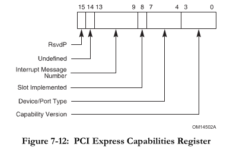

# Documentation

## Contents
<!--ts-->
  * [Usage](#usage)
  * [Creating the JSON](#creating-the-json)
  * [Writing the Whole Register](#writing-the-whole-register)
  * [Reading the Whole Register](#reading-the-whole-register)
  * [Clearing the Whole Register](#clearing-the-whole-register)
  * [Reading Fields](#reading-fields)
  * [Writing Fields](#writing-fields)
  * [Negative Fields](#negative-fields)
<!--te-->

## Usage
Usage is dead simple. Just pass the path to the JSON file as an argument to the CLI.

```bash
register_generator --path ./test.json
```

## Creating the JSON

Let's say we are working with a PCIe driver, and we need to control PCIe registers. For this example we will work with the PCIe Capabilities Register, the definition of which can be found in the **PCI Express Base r3.0** specification in **Section 7.8.2**. The register definition is as follows:

| Bit Location | Description |
| --- | --- |
| 3:0 | Capability Version |
| 7:4 | Device/Port Type |
| 8:8 | Slot Implemented |
| 13:9 | Interrupt Message Number |
| 14:14 | [Deprecated] TCS Routing Support |
| 15 | Reserved |

From the PCIe Spec mentioned before:



Let's say we want to figure out the device/port type, we will need to check bits 7:4.

The encoding for those bits is:

| Encoding | Meaning |
| --- | --- |
| 0000b | PCI Express Endpoint |
| 0001b | Legacy PCI Express Endpoint |
| 0100b | Root Port of PCI Express Root Complex |
| 0101b | Upstream Port of PCI Express Switch |
| 0110b | Downstream Port of PCI Express Switch |
| 0111b | PCI Express to PCI/PCI-X Bridge |
| 1000b | PCI/PCI-X to PCI Express Bridge |
| 1001b | Root Complex Integrated Endpoint |
| 1010b | Root Complex Event Collector |

Creating a JSON file that would support only this register would look something like this:

```json
{
    "register_family":"HIF",
    "register_family_widths":[16],
    "registers":[
        {
            "name":"PCIeCapabilitiesRegister",
            "size":16,
            "fields":[
                {
                    "name":"capability_version",
                    "lsb":0,
                    "msb":3,
                    "read":true,
                    "write":false
                },
                {
                    "name":"device_port_type",
                    "lsb":4,
                    "msb":7,
                    "read":true,
                    "write":false
                },
                {
                    "name":"slot_implemented",
                    "lsb":8,
                    "msb":8,
                    "read":true,
                    "write":false
                },
                {
                    "name":"interrupt_message_number",
                    "lsb":9,
                    "msb":13,
                    "read":true,
                    "write":false
                }
            ]
        }
    ]
}
```

Note that I left out deprecated and reserved bits from the JSON. This makes it so that no get or set methods are avaialable for them. Alternatively if you really want every bit accounted for in the JSON, you can define them there but leave `read` and `write` false, which will accomplish the same task. This generally allows you to completely omit reserved and deprecated bits from the interface to the regsiter entirely.

Running the generator on this JSON file will yield two generated files. It will yield a `Register16.h` file containing the following code:

```cpp
// This file was automatically generated by a register generation tool
// https://github.com/regerj/register_generator
// Any changes to this file may be overwritten on subsequent generations

#pragma once

#include <cstdint>

class Register16 {
public:
	Register16() = default;
	inline uint16_t get_register_value() const { return register_raw; };
	inline void clear_register_value() { register_raw = 0x0; };
	inline void set_register_value(uint16_t value) { register_raw = value; };

	// Bitwise operator overloading
	/* -- snip -- */
protected:
	uint16_t register_raw = 0x0;
};
```

This file is just canned code for the concept of a 16 bit register. If we had included 32 into our `register_family_widths` array, it would have also generated a 32 bit version of this file. The second file is more relevant for our particular use. The other file will be called `HIFRegisters.h` which will contain definitions for every register we defined in our JSON file. The file will be named according to the `register_family` value in the top level JSON object.

The code that will be generated looks like this:

```cpp
// This file was automatically generated by a register generation tool
// https://github.com/regerj/register_generator
// Any changes to this file may be overwritten on subsequent generations

#pragma once

#include <cstdint>

#include "Register16.h"

class PCIeCapabilitiesRegister : public Register16 {
public:
	PCIeCapabilitiesRegister() : Register16() {};

	// Get methods
	inline uint16_t get_capability_version() const {
		uint16_t buffer = register_raw >> 0;
		return buffer & (UINT16_MAX >> (16 - 1 - (3 - 0)));
	}
	inline uint16_t get_device_port_type() const {
		uint16_t buffer = register_raw >> 4;
		return buffer & (UINT16_MAX >> (16 - 1 - (7 - 4)));
	}
	inline uint16_t get_slot_implemented() const {
		uint16_t buffer = register_raw >> 8;
		return buffer & (UINT16_MAX >> (16 - 1 - (8 - 8)));
	}
	inline uint16_t get_interrupt_message_number() const {
		uint16_t buffer = register_raw >> 9;
		return buffer & (UINT16_MAX >> (16 - 1 - (13 - 9)));
	}

	// Set methods
};
```

Take note of a couple important attributes here. First, we inherit from the Register16 class generated in the other file. Next, The class is named according to the `name` value we provided in the register JSON object. Notice that we also have get methods for each field, but no set methods. This is in accordance with our `read` and `write` values within each `field` JSON object. If we mark something with read permissions, a get method will be generated for it. If we mark something with write permissions, a set method will be generated for it. With all read only fields in this register, we have no set methods. Lastly, notice that the field names are generated according to the `name` value provided in each `field` JSON object.

If we had defined other registers in the `registers` array, then other class definitions would have been appended below this one. They would all remain in the same file. If you want seperate files for different kinds of registers, then create different JSON files for each register family and run the generator on all of them.

The number of registers is variable, as is the number of fields within each register. Append as you like, but all JSON objects must match with keys and value types. I have not yet implemented a schema to validate it, so it is on you until I can implement that.

## Writing the Whole Register

```cpp
PCIeCapabilitiesRegister pcie_cap_reg;
pcie_cap_reg.set_register_value(0xDEAD);
```

This will set the underlying 16 bit integer to be `0xDEAD`.

It is recommended that you design your APIs around this concept of a `Register16` object. This would most often be used to populate the register using some `read_register()` method that might exist in your codebase. See below:

```cpp
void read_register(uint32_t address, Register16 &value) {
    /* pseudocode */
    value.set_register_vale(*address);
}

/* --snip-- */

PCIeCapabilitiesRegister pcie_cap_reg;
read_register(0x1234'5678, pcie_cap_reg);
```

This will populate the `pcie_cap_reg` with whatever is at the address `0x1234'5678`.

If you are trying to integrate with an existing API that does not make use of this concept of a `Register16` object, that can still be done.

```cpp
uint16_t read_register(uint32_t address) {
    /* pseudocode */
    return *address;
}

/* --snip-- */

PCIeCapabilitiesRegister pcie_cap_reg;
pcie_cap_reg.set_register_value(read_register(0x1234'5678));
```

## Reading the Whole Register
```cpp
PCIeCapabilitiesRegister pcie_cap_reg;
uint16_t register_value = pcie_cap_reg.get_register_value();
```

`register_value` now contains the raw register value. It is recommended that you design your APIs around this concept of a `Register16` object. This can be useful if you have some write register function like:

```cpp
void write_register(uint32_t address, const Register16 &value) {
    /* pseudocode */
    *address = value.get_register_value();
}

/* --snip-- */

PCIeCapabilitiesRegister pcie_cap_reg;
pcie_cap_reg.set_register_value(0xDEAD);
write_register(0x1234'5678, pcie_cap_reg);
```

This code will write the value `0xDEAD` to the address `0x1234'5678`. Normally the `pcie_cap_reg` would be initially populated using the named access methods, but we haven't gone over those yet. They will be documented later in this file.

If you are trying to integrate with an existing API that does not make use of this concept of a `Register16` object, that can still be done.

```cpp
void write_register(uint32_t address, uint16_t value) {
    /* pseudocode */
    *address = value;
}

/* --snip-- */

PCIeCapabilitiesRegister pcie_cap_reg;
pcie_cap_reg.set_register_value(0xDEAD);
write_register(0x1234'5678, pcie_cap_reg.get_register_value());
```

## Clearing the Whole Register
```cpp
void read_register(uint32_t address, Register16 &value) {
    /* pseudocode */
    value.set_register_vale(*address);
}

/* --snip-- */

PCIeCapabilitiesRegister pcie_cap_reg;
read_register(0xDEAD'BEEF, pcie_cap_reg);

// Do some work with pcie_cap_reg

// You can clear the register if needed to reuse the same object
pcie_cap_reg.clear_register_value();
```

This is a niche use case, but it's available if you want it. It is pretty much the same as just setting the register value to be `0x0`.

## Reading Fields
Reading fields is done by calling the get method for that respective field. This method will be called `get_ + {field name}`, for example: `get_your_field_name()`.
```cpp
void read_register(uint32_t address, Register16 &value) {
    /* pseudocode */
    value.set_register_vale(*address);
}

/* --snip-- */

// Assume that *(0x1234'5678) == 0xBEEF
PCIeCapabilitiesRegister pcie_cap_reg;
read_register(0x1234'5678, pcie_cap_reg);

assert(pcie_cap_reg.get_capability_version() == 0x000F);
```

## Writing Fields
Writing fields is done in much the same way as reading. It is done by calling the set method for that respective field. The method will be called in a similar naming convention: `set_ + {field name}`, for example `set_your_field_name()`. In our example so far, the `pcie_cap_reg` has only contained read-only fields. Let's assume, for this example only, that those fields are read and write.

```cpp
void write_register(uint32_t address, const Register16 &value) {
    /* pseudocode */
    *address = value.get_register_value();
}

/* --snip-- */

PCIeCapabilitiesRegister pcie_cap_reg;
pcie_cap_reg.set_capability_version(0xF);
pcie_cap_reg.set_device_port_type(0xF);
pcie_cap_reg.set_slot_implemented(1);

assert(pcie_cap_reg.get_register_value() == 0x01FF);

// Possibly write our newly calculated register value
write_register(0x1234'5678, pcie_cap_reg);
```

This code shows how you can use these register objects to easily configure a register with certain bit field values in a memory safe and self documenting manner, and write it to memory with either an API designed around this `Register16` concept, or an existing API designed around `uint16_t`.

## Negative Fields
There is an optional key that can be provided to the JSON, `negative`. This key is defaulted to false if omitted. As the name implies, it indicates that the field containing it should support negative numbers. Most register values do not contain signed integers, but some do. One such example is transmission coefficients. This generator only supports 2's complement negative numbers at the moment. If a field is marked as negative, the get and set APIs will look different. For example, if we had marked the interrupt message number as read/write and negative, its get and set APIs would have the following signatures:

```cpp
inline int16_t get_interrupt_message_number() const;

inline bool set_interrupt_message_number(int16_t value);
```

The corresponding JSON object for the field would look like this:

```json
{
    "name":"interrupt_message_number",
    "lsb":9,
    "msb":13,
    "read":true,
    "write":true,
    "negative":true
}
```

You can see that now instead of the get method returning a `uint16_t` it now returns an `int16_t`. This will contain the valid 16 bit width signed representation of the number, regardless of the length of the field. This means that a value of -4 stored in this 5 bit field will be returned as the 16 bit representation of -4. The below code asserts this.

```cpp
// Assume that pcie_cap_reg.interrupt_message_number is -4
PCIeCapabilitiesRegister pcie_cap_reg;

int16_t actual_value = pcie_cap_reg.get_interrupt_message_number();
assert(actual_value == -4);
```

Similarly, the set API now takes in an `int16_t` instead of a `uint16_t` and will still properly bounds check the value you attempt to write. To write a value of -4, it is as simple as:

```cpp
PCIeCapabilitiesRegister pcie_cap_reg;

pcie_cap_reg.set_interrupt_message_number(-4);
```
